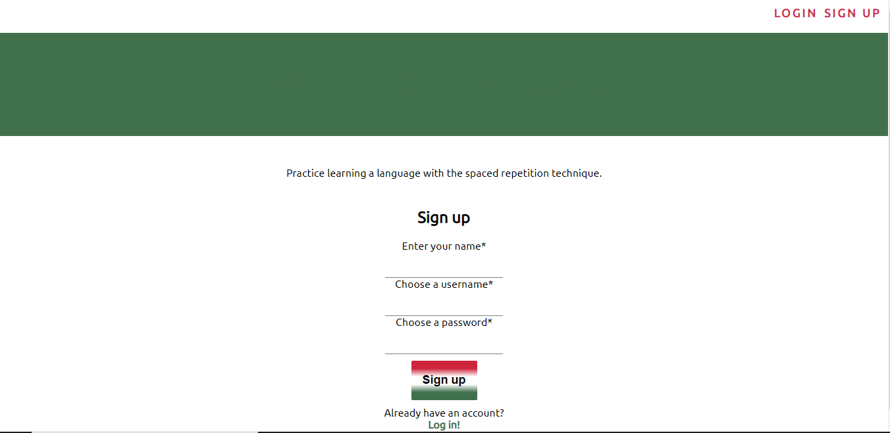
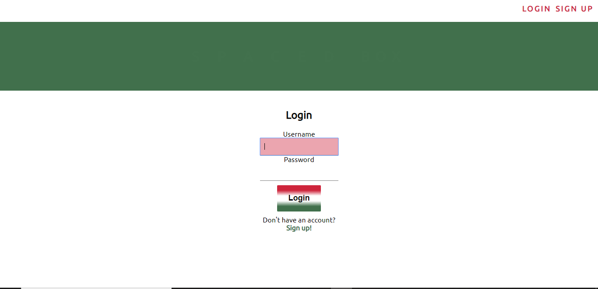
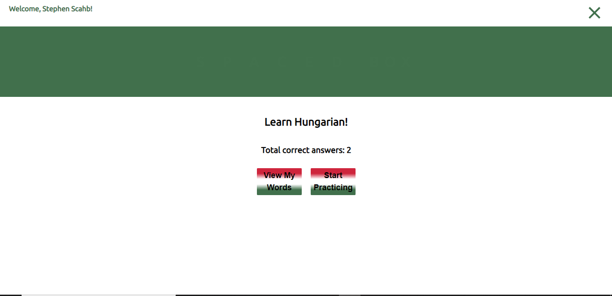
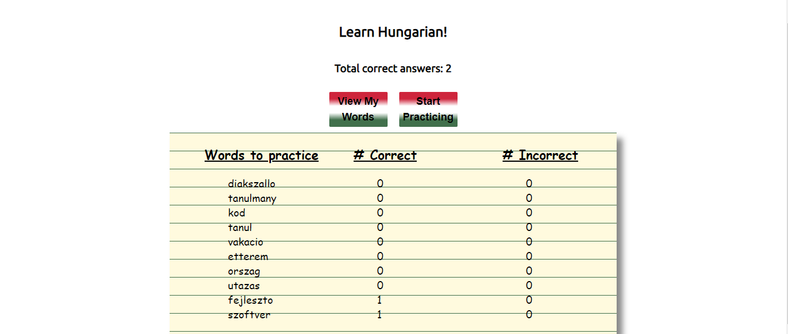
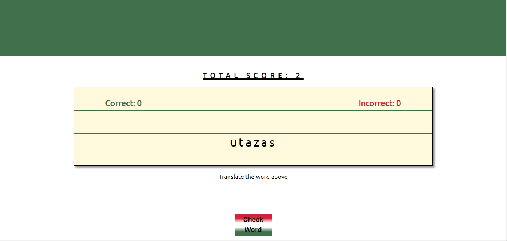
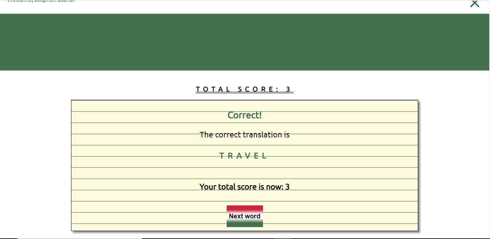
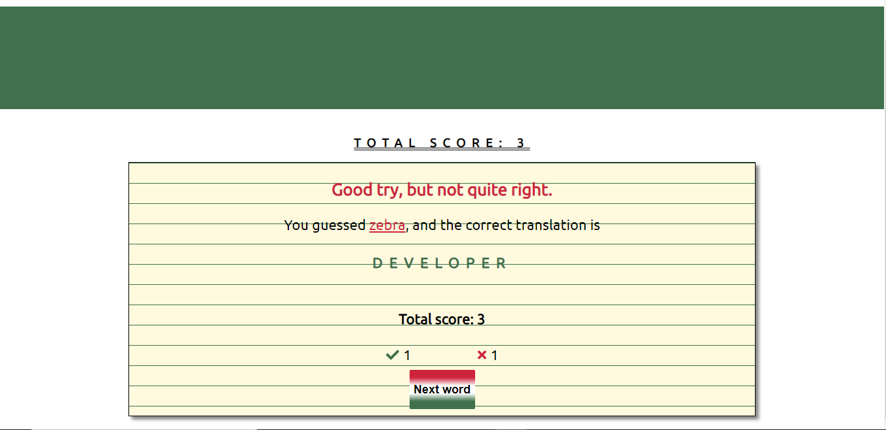

# Spaced Box App (Client)

Created by: Wendy Bartos and Stephen Schab
---

## Repo & Live Links

[Live App](https://spacedbox.now.sh/)
[API Repo](https://github.com/thinkful-ei-iguana/stephen-wendy-spaced-repetition-api)

## Summary

  Spaced Box is a language learning app that uses spaced repetition to teach a user a new language. The user is able to create an account and login. Whenever a user submits their guess on the translation of their word, if the user was correct the word moves back in line a certain number of spaces. When the guess is incorrect the word moves back one space. Users are able to see their progress in the language on the dashboard. Showing their total overall score, as well as the correct and incorrect for each word.

## Image Guide

### Registration Page

### Login Page

### Dashboard

### User Word List

### Learning Page

### Correct Page

### Incorrect Page

## Technology Used

FRONT END - REACT | CSS | JavaScript

BACK END - NODE | EXPRESS | POSTGRESQL | MOCHA & CHAI | JWT